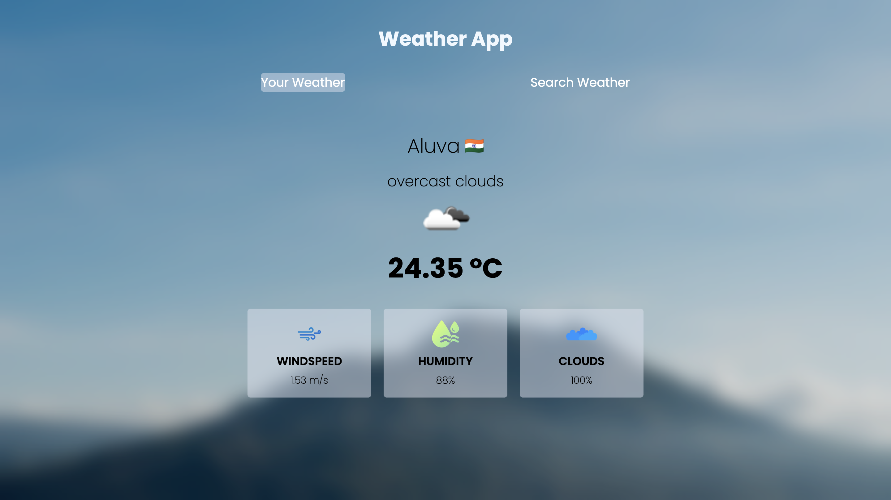

# 🌤️ Weather App

A dynamic and responsive weather application built using HTML, CSS, and Vanilla JavaScript. It provides real-time weather updates based on the user's current location or by searching for a specific city. 

**🚀 Live Demo:** [https://weather-app-five-omega-54.vercel.app/](https://weather-app-five-omega-54.vercel.app/)

## ✨ Features

- **Your Weather:** Automatically detects your current location (via Geolocation API) and displays the local weather.
- **Search Weather:** Look up the current weather conditions for any city around the globe.
- **Live Data:** Fetches real-time weather metrics including temperature, wind speed, humidity, and cloudiness using the OpenWeatherMap API.
- **Session Storage:** Caches your location coordinates so you don't have to grant permission every time you refresh.
- **Error Handling:** Gracefully handles invalid city searches or API failures with custom error UI.

## 📸 Screenshot



## 🛠️ Tech Stack

- **HTML5:** Semantic structuring of the app.
- **CSS3:** Custom styling, animations, and responsive layout.
- **Vanilla JavaScript:** DOM manipulation, event handling, and API integration.
- **OpenWeatherMap API:** REST API used to fetch live weather data.

## 🚀 Getting Started

To run this project locally, follow these steps:

1. Clone the repository:
   ```bash
   git clone https://github.com/abhishekvarma149/Weather-App.git
   ```
2. Navigate to the project folder:
   ```bash
   cd "Whether App"
   ```
3. Open `index.html` in your favorite web browser or start a local live server.

## 🔑 API Key Configuration

This project requires an API key from OpenWeatherMap. 
1. Go to [OpenWeatherMap](https://openweathermap.org/) and create a free account.
2. Generate an API key.
3. Replace the `API_KEY` variable in `script.js` with your own key:
   ```javascript
   const API_KEY = "YOUR_API_KEY_HERE";
   ```

## 🤝 Contributing

Contributions, issues, and feature requests are welcome! 
Feel free to check [issues page](https://github.com/abhishekvarma149/Weather-App/issues).
